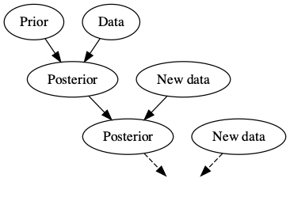
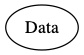
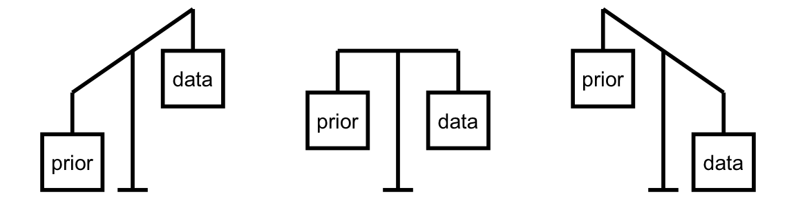

class: title-slide


<br>
<br>
.right-panel[ 

# `r rmarkdown::metadata$title`
## `r rmarkdown::metadata$author`
Examples from [bayesrulesbook.com](https://bayesrulesbook.com)

]


---

class: middle

> How can we live if we don't change?  
Beyoncé

---

class: middle center

### Bayesian Knowledge Building

```{r echo = FALSE, fig.align='center'}

```


---

class: middle center

### Frequentist Knowledge Building

```{r echo = FALSE, fig.align='center'}

```

---

class: middle center

### Balancing Act of Bayesian Analysis

```{r echo = FALSE, fig.align='center', out.width="80%"}

```

---

## Interpretation of Probability

**Bayesian**: a probability measures the relative plausibility of an event.

**Frequentist**: a probability measures the long-run relative frequency of a repeatable event. In fact, “frequentists” are so named because of their interpretation of probability as a long-run relative frequency.

---

### Prior Data

Consider two claims. (1) Zuofu claims that he can predict the outcome of a coin flip. To test his claim, you flip a fair coin 10 times and he correctly predicts all 10! 

(2) Kavya claims that she can distinguish natural and artificial sweeteners. To test her claim, you give her 10 sweetener samples and she correctly identifies each! In light of these experiments, what do you conclude?

a. You’re more confident in Kavya’s claim than Zuofu’s claim.

b. The evidence supporting Zuofu’s claim is just as strong as the evidence supporting Kavya’s claim.

---

### Hypothesis Testing

Suppose that during a recent doctor’s visit, you tested positive for a very rare disease. If you only get to ask the doctor one question, which would it be?

a. What’s the chance that I actually have the disease?  
b. If in fact I don’t have the disease, what’s the chance that I would’ve gotten this positive test result?

--

a. $P(disease | +)$  
b. $P(+ | disease^c)$


---

# Notes on Bayesian History

- Named after Thomas Bayes (1701-1761).

--

- Frequentist statistics is more popular and Bayesian statistics is starting to get popular. 

--

- Computing, computing, computing.

--

- It is harder to adopt to newer methods. Thus change is happening slowly. 

--

- We can embrace subjectivity. 

---

class: middle 

# Optional

Watch [How Data Nerds Found A 131-Year-Old Sunken Treasure](https://fivethirtyeight.com/features/how-data-nerds-found-a-131-year-old-sunken-treasure/)

