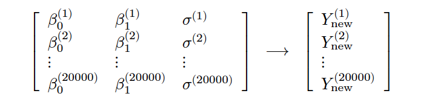

class: title-slide

```{r child = "../setup.Rmd"}
```

```{r echo=FALSE, message=FALSE}
library(bayesrules)
library(tidyverse)
library(rstanarm)
library(bayesplot)
library(janitor)
library(rstan)
```

<br>
<br>
.right-panel[ 

# `r rmarkdown::metadata$title`
## `r rmarkdown::metadata$author`
Examples from [bayesrulesbook.com](https://bayesrulesbook.com)

]

---

class: middle

```{r echo=FALSE}

```


---

```{r echo=FALSE}
normal_model_sim <- stan_glm(
  rides ~ temp_feel, data = bikes, 
  family = gaussian, 
  chains = 4, iter = 5000*2, seed = 84735, refresh = 0)
normal_model_df <- as.data.frame(normal_model_sim)

```


```{r}
head(normal_model_df, 1)
`(Intercept)` <- round(head(normal_model_df, 1)$`(Intercept)`)
temp_feel     <- round(head(normal_model_df, 1)$temp_feel, 2)
sigma         <- round(head(normal_model_df, 1)$sigma)


```

---

```{r}
`(Intercept)`
temp_feel
sigma
```

---

```{r echo = FALSE}
b01  <- round(head(normal_model_df, 1)[1,1])
b11  <- round(head(normal_model_df, 1)[1,2],2)
sig1 <- round(head(normal_model_df, 1)[1,3])
pred <- b01 + b11*75
```


Under this particular scenario, $\left(\beta_0^{(1)}, \beta_1^{(1)}, \sigma^{(1)}\right) = (`r b01`, `r b11`, `r sig1`)$, thus the regression trend is defined by

$$\beta_0^{(1)} + \beta_1^{(1)} X = `r b01` + `r b11`X \; .$$

```{r}
y_trend <- `(Intercept)` + temp_feel*75
y_trend
```

---

To capture the __sampling variability__ around this plausible trend, ie. the fact that not all 75 degree days have this exact ridership, we can simulate our first official prediction $Y_{\text{new}}^{(1)}$ by taking a random draw from the Normal likelihood specified by this first parameter set:

$$Y_{\text{new}}^{(1)} | \beta_0, \beta_1, \sigma  \; \sim \; N\left(`r pred`, `r sig1`^2\right) \; .$$


```{r}
set.seed(84735)
y_new <- rnorm(1, y_trend, sigma)
y_new
```

---

```{r echo = FALSE}
set.seed(84735)
y_new <- rnorm(1, y_trend, sig1)

ggplot(bikes, aes(x = temp_feel, y = rides)) + 
  geom_abline(aes(intercept = b01, slope = b11)) + 
  lims(x = c(45,90), y = c(0, 7000)) + 
  geom_segment(aes(x = 75, xend = 75, y = 0, yend = pred), linetype = "dashed") +
  geom_segment(aes(x = 45, xend = 75, y = pred, yend = pred), linetype = "dashed") + 
  geom_point(aes(x = 75, y = y_new))
```

---

```{r}
# Predict rides for each parameter set in the chain
set.seed(84735)
predict_75 <- normal_model_df %>% 
  mutate(y_trend = `(Intercept)` + temp_feel*75) %>% 
  mutate(y_new = rnorm(20000, y_trend, sigma))
```

--

```{r}
head(predict_75, 3)
```


---

```{r eval = FALSE}
ggplot(predict_75, aes(x = y_trend)) + 
  geom_density()
ggplot(predict_75, aes(x = y_new)) + 
  geom_density()
```

```{r fig.width = 15, echo = FALSE, fig.height=4}
g1 <- ggplot(predict_75, aes(x = y_trend)) + 
  geom_density() +
  lims(x = range(predict_75$y_new), y = c(0, 0.0065))
g2 <- ggplot(predict_75, aes(x = y_new)) + 
  geom_density() +
  lims(x = range(predict_75$y_new), y = c(0, 0.0065))
gridExtra::grid.arrange(g1,g2,ncol=2)
```

---

```{r}
# Construct 80% posterior credible intervals
predict_75 %>% 
  summarize(lower_trend = quantile(y_trend, 0.1),
    upper_trend = quantile(y_trend, 0.9),
    lower_new = quantile(y_new, 0.1),
    upper_new = quantile(y_new, 0.9))
```

---

```{r}
# Simulate a set of predictions
set.seed(84735)
shortcut_prediction <- posterior_predict(
  normal_model_sim, 
  newdata = data.frame(temp_feel = 75))
head(shortcut_prediction, 3)
```

---

```{r fig.height=5}
# Plot the approximate predictive model
mcmc_dens(shortcut_prediction) + 
  labs(x = "predicted ridership on a 75 degree day")
```


---

```{r}
# Construct an 80% posterior credible interval
predictions <- data.frame(y_new = shortcut_prediction[,1]) 
predictions %>% 
  summarize(lower_80 = quantile(y_new, 0.1),
    upper_80 = quantile(y_new, 0.9))
```


